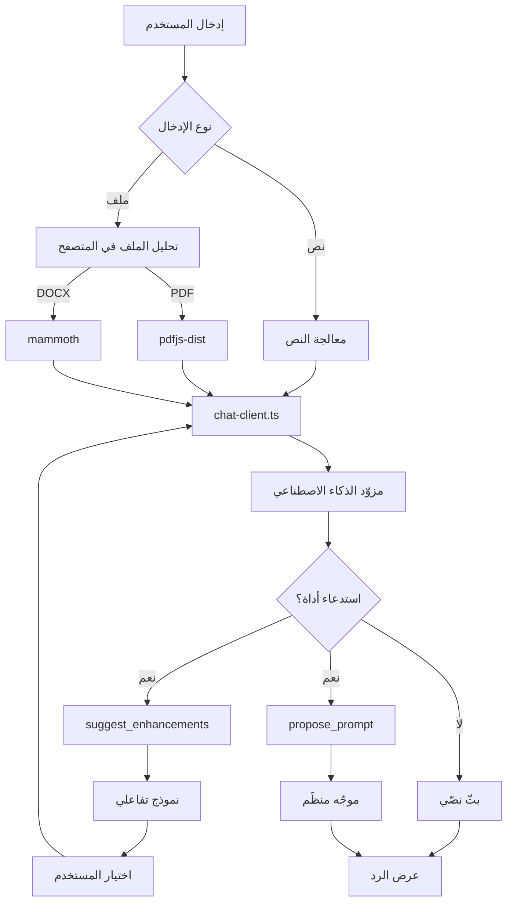

<div align="center">
  

  # 🚀 مُحسِّن الموجّهات التفاعلي

  ### Interactive Prompt Iterator

  <p align="center">
    <strong>حوِّل الأفكار الغامضة إلى موجّهات ذكاء اصطناعي منظّمة وعالية الجودة عبر حوار تفاعلي متعدّد الجولات</strong>
  </p>

  <p align="center">
    <a href="https://nextjs.org/">
      
    </a>
    <a href="https://www.typescriptlang.org/">
      
    </a>
    <a href="https://tailwindcss.com/">
      
    </a>
    <a href="https://tauri.app/">
      
    </a>
  </p>

  <p align="center">
    <strong>العربية</strong> • <a href="#-البدء-السريع">البدء السريع</a> • <a href="docs/GUIDE_AR.md">الدليل بالعربية</a>
  </p>

</div>

---

## 📑 المحتويات

- [نبذة عن المشروع](#-نبذة-عن-المشروع)
- [لماذا هذا المشروع؟](#-لماذا-هذا-المشروع)
- [الميزات الأساسية](#-الميزات-الأساسية)
- [التقنيات المستخدمة](#️-التقنيات-المستخدمة)
- [البدء السريع](#-البدء-السريع)
- [الإعداد](#️-الإعداد)
- [البناء لسطح المكتب (Tauri)](#-البناء-لسطح-المكتب-tauri)
- [اختصارات لوحة المفاتيح](#️-اختصارات-لوحة-المفاتيح)
- [بنية المشروع](#-بنية-المشروع)
- [البنية المعمارية](#️-البنية-المعمارية)
- [الأسئلة الشائعة](#-الأسئلة-الشائعة)
- [المساهمة](#-المساهمة)
- [الرخصة](#-الرخصة)

---

## 📖 نبذة عن المشروع

**مُحسِّن الموجّهات التفاعلي** تطبيق يساعدك على تحويل فكرة غامضة إلى **موجّه (Prompt) منظّم وعالي الجودة** للذكاء الاصطناعي، عبر إرشادك بحوار تفاعلي وخيارات متعدّدة الأبعاد بدلاً من كتابة الموجّه يدويًا من الصفر.

الواجهة تدعم **العربية والإنجليزية** مع اتجاه RTL كامل للعربية، وكل البيانات تُحفظ **محليًا** في متصفّحك. المشروع جاهز للعمل كتطبيق ويب أو كتطبيق **سطح مكتب عبر Tauri v2** (Static Export).

---

## 🎯 لماذا هذا المشروع؟

| الطريقة التقليدية | هذا المشروع |
|---|---|
| ❌ تحتاج لتصميم بنية الموجّه بنفسك | ✅ إرشاد تفاعلي يولّد موجّهات منظّمة تلقائيًا |
| ❌ تجربة وخطأ بكفاءة منخفضة | ✅ خيارات متعدّدة الأبعاد لتوضيح المتطلبات بسرعة |
| ❌ صعوبة إعادة استخدام الموجّهات | ✅ إدارة قوالب وتطبيقها بنقرة واحدة |
| ❌ لا يتعامل مع المستندات المعقّدة | ✅ دعم تحليل PDF وWord والصور |
| ❌ تحتاج لحفظ صياغات معقّدة | ✅ نماذج مرئية بلا منحنى تعلّم |

---

## ✨ الميزات الأساسية

- **🎯 إرشاد تفاعلي ذكي**: توضيح المتطلبات تدريجيًا عبر نماذج تفاعلية وحوار متعدّد الجولات.
- **💾 محلي أولاً (Local-First)**:
  - الإعدادات: `Zustand` + `LocalStorage` لحفظ مفتاح API وتفضيلات النماذج.
  - السجلّ: `Dexie.js` (IndexedDB) لحفظ المحادثات والوصول دون اتصال.
- **🌍 تعدّد اللغات**: دعم كامل للتبديل بين **العربية والإنجليزية** مع واجهة RTL للعربية.
- **🎨 واجهة حديثة**: مبنية بـ Tailwind CSS + shadcn/ui، مع وضع ليلي/نهاري وتصميم متجاوب.
- **📁 دعم الملفات**: رفع ولصق الصور (PNG/JPG/WebP)، وتحليل PDF وDOCX مباشرةً في المتصفح.
- **🔧 إعداد مرن**: دعم مزوّدين متعدّدين (OpenAI، Claude، DeepSeek وغيرها)، و`Base URL` مخصّص، وموجّه نظام قابل للتعديل، واستيراد/تصدير الإعدادات.
- **⌨️ اختصارات لوحة المفاتيح**: مجموعة شاملة لتسريع العمل (اضغط `Shift+/` لعرضها كلها).
- **🖥️ جاهز لسطح المكتب**: يُصدَّر كملفات ثابتة (Static Export) ليعمل داخل Tauri v2.

---

## 🛠️ التقنيات المستخدمة

- **الإطار**: Next.js 14.2 (App Router) مع `output: 'export'`
- **الواجهة**: Tailwind CSS 3.4، shadcn/ui، Lucide React
- **إدارة الحالة**: Zustand 5.0
- **قاعدة البيانات**: Dexie.js 4.2 (غلاف لـ IndexedDB)
- **تكامل الذكاء الاصطناعي**: نداء مباشر من المتصفح لواجهة متوافقة مع OpenAI (`/chat/completions`) مع بثّ (streaming)
- **معالجة الملفات**: pdfjs-dist (PDF) وmammoth (DOCX)
- **التدويل**: next-intl 3.26 (عربي/إنجليزي)
- **سطح المكتب**: Tauri v2 (مستهدَف)

---

## 🚀 البدء السريع

1. **استنساخ المستودع**
```bash
git clone https://github.com/3ssiri/muharrir.git
cd muharrir
```

2. **تثبيت الاعتماديات**
```bash
npm install
```

3. **تشغيل خادم التطوير**
```bash
npm run dev
```

4. **فتح التطبيق**
افتح المتصفح على [http://localhost:3000](http://localhost:3000)

---

## ⚙️ الإعداد

1. انقر على أيقونة **الإعدادات (⚙️)** أعلى الواجهة.
2. أدخل إعدادات الذكاء الاصطناعي:
   - **مفتاح API**: مفتاح OpenAI/Claude أو أي مزوّد متوافق.
   - **Base URL**: عنوان واجهة المزوّد (الافتراضي: `https://api.openai.com/v1`).
   - **النموذج**: اختر النموذج المطلوب.
   - **نموذج التصحيح**: نموذج تصحيح الصيغة تلقائيًا (الافتراضي: `grok-beta-fast`).
   - **موجّه النظام**: موجّه نظام مخصّص (اختياري).
3. احفظ لتبدأ الاستخدام.

> 💡 جميع الإعدادات تُحفظ محليًا في المتصفّح ولا تُرفع لأي خادم.

### النماذج المدعومة

- **OpenAI**: gpt-4o، gpt-4o-mini، gpt-4-turbo، o1، o1-mini
- **Anthropic Claude**: claude-3-5-sonnet، claude-3-5-haiku، claude-3-opus
- **نماذج أخرى متوافقة**: deepseek-chat، deepseek-reasoner، GLM-4-Plus، Qwen-Max، moonshot-v1-128k وغيرها

---

## 🖥️ البناء لسطح المكتب (Tauri)

التطبيق مُهيّأ للتصدير الثابت (`output: 'export'`) ليعمل داخل Tauri v2 بلا خادم.

```bash
# توليد الواجهة الثابتة في مجلد out/
npm run build

# تشغيل نافذة Tauri في وضع التطوير (بعد تهيئة src-tauri/)
npm run tauri dev

# بناء حزمة سطح المكتب للتوزيع
npm run tauri build
```

> 📌 لأن التصدير الثابت لا يدعم مسارات الخادم، يتم استدعاء الذكاء الاصطناعي وتحليل الملفات **من جانب المتصفح مباشرةً** عبر `src/lib/chat-client.ts` و`src/lib/file-parser-client.ts`. راجع [الدليل بالعربية](docs/GUIDE_AR.md) لتفاصيل التحويل والإعداد.

---

## ⌨️ اختصارات لوحة المفاتيح

| الاختصار | الوظيفة |
|---|---|
| `Ctrl+K` / `⌘+K` | فتح بحث Spotlight |
| `Ctrl+N` / `⌘+N` | محادثة جديدة |
| `Ctrl+/` / `⌘+/` | التركيز على حقل الإدخال |
| `Alt+S` | فتح الإعدادات |
| `Ctrl+B` / `⌘+B` | إظهار/إخفاء الشريط الجانبي |
| `Tab` | التبديل بين المحادثة والمفضّلة |
| `Shift+/` | عرض لوحة الاختصارات |
| `Enter` | إرسال الرسالة |
| `Shift+Enter` | سطر جديد |

---

## 📁 بنية المشروع

```
├── src/
│   ├── app/
│   │   ├── [locale]/          # صفحات التدويل (عربي/إنجليزي)
│   │   │   ├── layout.tsx     # التخطيط + RTL + generateStaticParams
│   │   │   └── page.tsx       # الصفحة الرئيسية للمحادثة
│   │   ├── layout.tsx
│   │   └── page.tsx           # إعادة توجيه الجذر حسب اللغة
│   ├── components/            # مكوّنات React (وui/ من shadcn)
│   ├── i18n/                  # إعداد next-intl + ملفات الترجمة (ar/en)
│   └── lib/
│       ├── chat-client.ts     # نداء الذكاء الاصطناعي client-side (بديل /api/chat)
│       ├── file-parser-client.ts # تحليل PDF/DOCX في المتصفح
│       ├── store.ts           # حالة Zustand
│       └── db.ts              # قاعدة Dexie.js
├── public/                    # موارد ثابتة (مع pdf.worker)
├── next.config.mjs            # output: 'export' + إعداد next-intl
└── package.json
```

---

## 🏗️ البنية المعمارية



---

## ❓ الأسئلة الشائعة

**١) كيف أضبط مفتاح API؟**
انقر أيقونة الإعدادات، أدخل المفتاح و`Base URL`، ثم احفظ.

**٢) هل تُدعَم المزوّدات الأخرى؟**
نعم، أي واجهة متوافقة مع OpenAI (DeepSeek، GLM، Qwen وغيرها).

**٣) هل بياناتي آمنة؟**
كل البيانات تُحفظ محليًا في المتصفح (IndexedDB)، ولا يُرفع مفتاح API لأي خادم.

**٤) هل تعمل على الجوال؟**
نعم، الواجهة متجاوبة وتدعم متصفّحات الجوال.

**٥) كيف أبني نسخة سطح المكتب؟**
راجع قسم [البناء لسطح المكتب](#-البناء-لسطح-المكتب-tauri) و[الدليل بالعربية](docs/GUIDE_AR.md).

---

## 🤝 المساهمة

المساهمات مُرحَّب بها:

1. اعمل Fork للمستودع.
2. أنشئ فرعًا للميزة (`git checkout -b feature/AmazingFeature`).
3. ثبّت تغييراتك (`git commit -m 'Add some AmazingFeature'`).
4. ادفع الفرع (`git push origin feature/AmazingFeature`).
5. افتح Pull Request.

---

## 📄 الرخصة

هذا المشروع مرخّص بموجب رخصة MIT — راجع ملف [LICENSE](LICENSE) للتفاصيل.

---

## 🙏 شكر وتقدير

- [Next.js](https://nextjs.org/) — إطار React
- [Tauri](https://tauri.app/) — إطار سطح المكتب
- [shadcn/ui](https://ui.shadcn.com/) — مكتبة مكوّنات الواجهة
- [Dexie.js](https://dexie.org/) — غلاف IndexedDB

---

<div align="center">
  <p>⭐ إذا أفادك هذا المشروع، فلا تنسَ منحه نجمة!</p>
</div>
