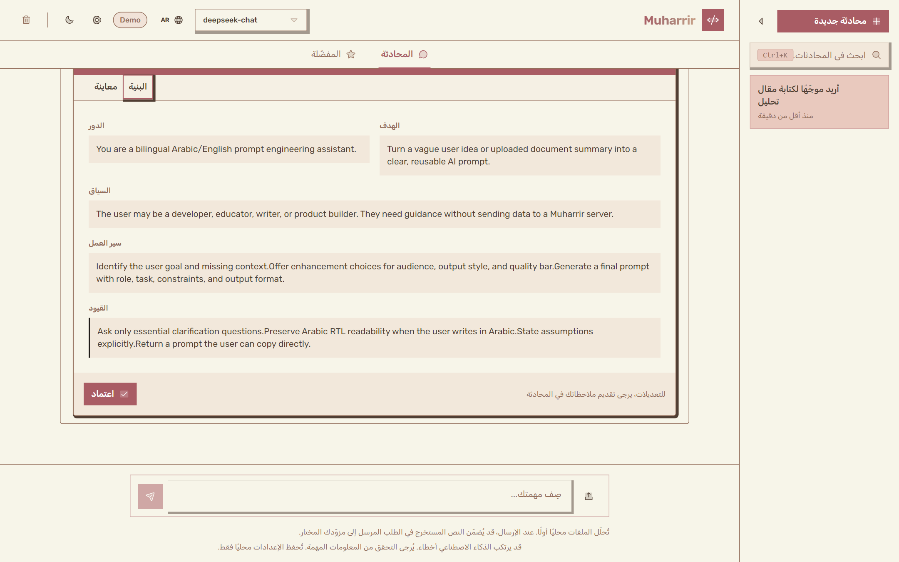

<div align="center">
  

  # Muharrir

  **Local-first Arabic/English prompt engineering workspace**

  Turn vague ideas, documents, and requirements into structured, reusable AI prompts through guided multi-step refinement.

  **محرر مساحة عمل محلية أولا بالعربية والإنجليزية لتحويل الأفكار والمستندات والمتطلبات الغامضة إلى موجهات ذكاء اصطناعي منظمة وقابلة لإعادة الاستخدام.**
</div>

---

## Why Muharrir?

Muharrir is not a general chat app. It is a prompt engineering workflow that helps users move from a rough idea to a copy-ready prompt through:

- Clarifying questions when the request is underspecified.
- Multi-dimensional enhancement choices.
- Structured final prompt proposals.
- Local-first conversation and settings storage.
- Arabic RTL and English support from the same interface.
- Web and desktop builds from the same codebase.

## Current OSS Status

Muharrir is prepared for public open-source release under the MIT license. The current beta is ready for local demos, provider testing, and early community review; the GitHub repository visibility still needs to be switched to public before submitting it as a public OSS grant application.

Read the readiness and application package:

- [OSS readiness plan](docs/oss-grant-readiness/README.md)
- [Execution checklist](docs/oss-grant-readiness/execution-checklist.md)
- [Decision log](docs/oss-grant-readiness/DECISIONS.md)
- [Governance](GOVERNANCE.md)
- [Privacy](PRIVACY.md)
- [Anthropic/OpenAI application package](docs/applications/README.md)

## Demo Preview



## Features

- Arabic and English UI with RTL support.
- Local-first history using IndexedDB.
- Tauri desktop mode with OS Keychain API key storage when available.
- Browser mode for local web use.
- Native Claude Messages API support.
- OpenAI-compatible providers through configurable `baseUrl`, model, and API key.
- PDF and DOCX parsing in the browser.
- Prompt comparison, favorites, preset modes, and import/export helpers.
- Demo mode using the API key value `demo`, with no external provider call.

## Quick Start

```bash
git clone https://github.com/3ssiri/muharrir.git
cd muharrir
npm ci
npm run dev
```

Open http://localhost:3000.

The dev and build scripts copy the PDF worker before running Next.js. Use `npm run dev` and `npm run build` instead of calling `next` directly.

## Try Demo Mode

You can try the first-use flow without a real API key:

1. Open settings.
2. Click **Use demo**, or set the API key to `demo`.
3. Send a rough idea, for example:

```text
حوّل فكرة دورة قصيرة عن أساسيات الذكاء الاصطناعي إلى موجه منظم
```

Demo mode is simulated locally. It does not call OpenAI, DeepSeek, or any other provider.

## Web vs Desktop

| Area | Web browser | Tauri desktop |
|---|---|---|
| App runtime | Static Next.js export | Static Next.js export inside Tauri |
| API calls | Directly to the configured provider; browser CORS may apply | Directly to the configured provider from the desktop app |
| API key storage | Browser local storage | OS Keychain when available |
| Keychain fallback | Not applicable | Fails closed; keys are not saved to localStorage |
| File parsing | Local browser parsing | Local WebView parsing |
| Project backend | None | None |

See [Privacy](docs/PRIVACY.md) for the detailed data flow.

## Configuration

Muharrir works with native Claude API and OpenAI-compatible providers. Configure:

- API key.
- Base URL, for example `https://api.anthropic.com/v1`, `https://api.openai.com/v1`, `https://api.deepseek.com`, or another compatible endpoint.
- Model name.
- Optional correction model.
- Optional custom system prompt.

Some providers do not allow direct browser requests because of CORS. In those cases, the desktop app may work better.

## Commands

```bash
npm run dev          # Start local web dev server on :3000
npm run build        # Static export to out/
npm run lint         # ESLint
npm run typecheck    # TypeScript check
npm run test:unit    # Vitest unit tests
npm test             # Playwright tests; requires npm run dev on :3000
npm run tauri dev    # Tauri desktop development
npm run tauri build  # Desktop packages
```

## Architecture

Muharrir is a client-side app by design:

- `src/lib/chat-client.ts` replaces a server `/api/chat` route and streams native Claude or OpenAI-compatible provider responses into the app protocol.
- `src/lib/chat-stream.ts` parses streamed text, tool calls, and error events.
- `src/lib/file-parser-client.ts` parses PDF and DOCX files in the browser.
- `src/lib/store.ts` stores settings with Zustand.
- `src/lib/db.ts` stores conversations and favorites with Dexie/IndexedDB.
- `src/lib/tauri-bridge.ts` wraps browser/Tauri differences for API key storage and connection testing.
- `src-tauri/src/lib.rs` provides desktop commands, tray behavior, global shortcut, updater setup, and provider connection checks.

No Next.js API routes or middleware are used because the app must remain compatible with static export and Tauri.

## Privacy

Muharrir does not run a central project server for prompts, files, or chat history.

- Conversations are stored locally.
- Uploaded PDF/DOCX files are parsed locally.
- With a real API key, prompts and selected file text are sent to the configured provider.
- With `demo`, no provider request is made.
- Desktop builds store API keys in OS Keychain and do not fall back to localStorage.

Read [docs/PRIVACY.md](docs/PRIVACY.md) before using sensitive prompts or documents.

## Contributing

Contributions are welcome. Please keep issues and pull requests free of API keys, private prompts, personal data, and private documents.

Useful docs:

- [Contributing guide](CONTRIBUTING.md)
- [Security policy](SECURITY.md)
- [Code of conduct](CODE_OF_CONDUCT.md)
- [Roadmap](docs/ROADMAP.md)
- [Provider and CORS guide](docs/providers.md)
- [Testing guide](docs/test-guide.md)
- [Changelog](CHANGELOG.md)

Before opening a PR, run:

```bash
npm run lint
npm run typecheck
npm run test:unit
npm run build
```

Do not paste API keys, private prompts, personal data, or private documents into issues, pull requests, screenshots, or test fixtures.

## License

Muharrir is licensed under the [MIT License](LICENSE).
