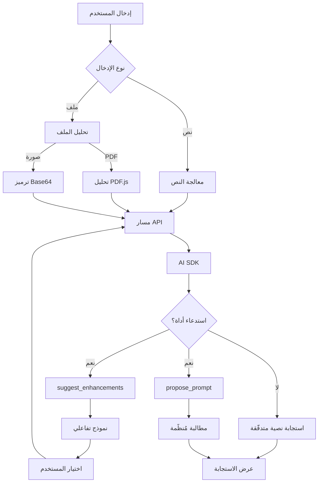

# 🚀 مُكرِّر المطالبات التفاعلي - اجعل الذكاء الاصطناعي يفهم احتياجاتك حقًا

> **تعريف بجملة واحدة**: حوِّل الأفكار الغامضة إلى مطالبات ذكاء اصطناعي مُنظَّمة وعالية الجودة عبر حوار تفاعلي متعدد الجولات

## 📌 خلفية المشروع

هل واجهت هذه المشكلات:
- ❌ لا تعرف كيف تصف احتياجاتك عند سؤال الذكاء الاصطناعي
- ❌ إجابات الذكاء الاصطناعي تنحرف دائمًا عن توقعاتك
- ❌ تريد نتائج دقيقة، لكنك لا تعرف كيف تحسّن المطالبة
- ❌ تضطر في كل مرة إلى تعديل المطالبة يدويًا، بكفاءة منخفضة

**مُكرِّر المطالبات التفاعلي** وُجد خصيصًا لحل نقاط الألم هذه!

## ✨ النقاط الأساسية المميزة

### 1. 🎯 إرشاد تفاعلي ذكي
لست بحاجة لأن تكون خبيرًا في المطالبات، فالذكاء الاصطناعي سيسأل بشكل استباقي:
- ما هو دورك الوظيفي؟
- من هو الجمهور المستهدف؟
- ما عمق المحتوى المطلوب؟
- ما تنسيق الإخراج المتوقع؟

عبر **النموذج التفاعلي**، يمكنك تحديد احتياجاتك ببضع نقرات!

### 2. 📁 دعم الملفات متعددة الوسائط
- 📄 ارفع أبحاث PDF، وسيحلل الذكاء الاصطناعي المحتوى تلقائيًا
- 🖼️ الصِق لقطات الشاشة، وسيفهم الذكاء الاصطناعي المعلومات البصرية
- 📊 دعم تنسيقات متعددة مثل DOCX و TXT

### 3. 💾 المحلية أولًا (Local-First)
- ✅ مفتاح API يُخزَّن محليًا في المتصفح فقط
- ✅ سجل المحادثة يُخزَّن دون اتصال باستخدام IndexedDB
- ✅ لا داعي للقلق من تسرّب الخصوصية

### 4. 🎨 تجربة عصرية
- دعم الوضع الداكن
- تصميم متجاوب (مناسب للأجهزة المحمولة)
- واجهة أنيقة مبنية على Shadcn/UI

## 🎬 عرض توضيحي للنتائج الفعلية

### السيناريو 1: كتابة مدونة تقنية

**إدخال المستخدم**: "ساعدني في كتابة مقال تقني عن React Server Components"

**يعرض الذكاء الاصطناعي فورًا نموذجًا تفاعليًا**:

| البُعد | الخيارات المتاحة |
|------|--------|
| تحديد الدور | مهندس واجهات أمامية خبير / مساهم أساسي في React / داعية تقني |
| الجمهور المستهدف | مبتدئ / مطوّر متوسط / مهندس معماري |
| عمق المحتوى | مقدمة عامة / درس تعليمي عملي / تحليل معماري معمّق |
| تنسيق الإخراج | مدونة Markdown / نص خطاب / سلسلة دروس |

**المطالبة المُولَّدة بعد اختيار المستخدم**:
```
أنت مهندس واجهات أمامية خبير يمتلك 5 سنوات من خبرة تطوير React. يُرجى كتابة مقال تقني موجّه للمطورين المتوسطين، يشرح بعمق مبدأ عمل React Server Components وحالات استخدامها وأفضل الممارسات.

المتطلبات:
1. تضمين أمثلة كود فعلية وبيانات مقارنة الأداء
2. شرح الفرق بين RSC و SSR التقليدي
3. توفير دليل ترحيل والمزالق الشائعة
4. تنسيق الإخراج: Markdown، يتضمن فهرسًا وإبراز الكود
5. عدد الكلمات: 2000-3000 كلمة
```

### السيناريو 2: تقرير تحليل البيانات

**إدخال المستخدم**: "حلِّل بيانات المبيعات هذه وأنشئ تقريرًا" + رفع ملف CSV

**يعرض الذكاء الاصطناعي بعد تحليل الملف**:

| البُعد | الخيارات المتاحة |
|------|--------|
| زاوية التحليل | تحليل الاتجاهات / تحليل المقارنة / تحليل التنبؤ |
| جمهور التقرير | الفريق التقني / الإدارة / العملاء |
| متطلبات التمثيل المرئي | اقتراح المخططات / جدول محوري للبيانات / تصميم لوحة معلومات |
| تنسيق الإخراج | مخطّط PPT / تقرير Word / تقرير HTML تفاعلي |

**المطالبة المُولَّدة**:
```
أنت خبير في تحليل البيانات. بناءً على ملف بيانات المبيعات CSV المُقدَّم، أنشئ تقرير تحليل مبيعات فصلي موجّهًا للإدارة.

متطلبات التحليل:
1. تحديد اتجاهات المبيعات والتقلبات الشاذة
2. مقارنة أداء خطوط المنتجات/المناطق المختلفة
3. تقديم توصيات عملية قابلة للتنفيذ
4. تضمين 3-5 مخططات تمثيل مرئي رئيسية (مخطط خطي، مخطط أعمدة، مخطط دائري)
5. تنسيق الإخراج: مخطّط PPT، يتضمن عنوان كل صفحة والنقاط الرئيسية وشرح المخططات
```

## 🛠️ التنفيذ التقني

### حزمة التقنيات
- **الواجهة الأمامية**: Next.js 14.2 + TypeScript + Tailwind CSS
- **تكامل الذكاء الاصطناعي**: Vercel AI SDK 6.0
- **إدارة الحالة**: Zustand 5.0
- **التخزين المحلي**: Dexie.js (IndexedDB)
- **تحليل الملفات**: pdfjs-dist 5.4

### البنية الأساسية



## 🚀 البدء السريع

### التجربة عبر الإنترنت
👉 [http://localhost:3000](http://localhost:3000)

### النشر المحلي

```bash
# 1. استنساخ المستودع
git clone https://github.com/3ssiri/muharrir.git
cd muharrir

# 2. تثبيت الاعتماديات
npm install

# 3. تشغيل خادم التطوير
npm run dev

# 4. افتح http://localhost:3000
```

### شرح التهيئة

1. انقر على **أيقونة الإعدادات (⚙️)** في أعلى اليمين
2. أدخل تهيئة AI API الخاصة بك:
   - **API Key**: مفتاح OpenAI/Claude/أي API متوافق آخر
   - **Base URL**: عنوان نقطة نهاية API (الافتراضي: `https://api.openai.com/v1`)
   - **Model**: اختر النموذج (يدعم GPT-4o و Claude 3.5 و DeepSeek وغيرها)

> 💡 جميع الإعدادات تُخزَّن محليًا في المتصفح فقط، ولن تُرفع إلى الخادم

## 🎯 نماذج الذكاء الاصطناعي المدعومة

- **OpenAI**: gpt-4o, gpt-4o-mini, gpt-4-turbo, o1, o1-mini
- **Anthropic Claude**: claude-3-5-sonnet, claude-3-5-haiku, claude-3-opus
- **النماذج الكبيرة المحلية**: deepseek-chat, deepseek-reasoner, GLM-4-Plus, Qwen-Max, moonshot-v1-128k

## 📊 حالات الاستخدام

✅ **الكتابة التقنية**: مقالات المدونات، الوثائق التقنية، كتابة الدروس التعليمية
✅ **تحليل البيانات**: توليد التقارير، اقتراحات التمثيل المرئي للبيانات
✅ **التحرير الأكاديمي**: تحسين ملخصات الأبحاث، تنظيم التعبير الأكاديمي
✅ **تصميم UI**: وثائق المتطلبات، تصميم تدفّق التفاعل
✅ **توليد الكود**: تنفيذ الخوارزميات، اقتراحات إعادة هيكلة الكود
✅ **إنشاء المحتوى**: نصوص تسويقية، محتوى وسائل التواصل الاجتماعي

## 🗺️ خارطة طريق التطوير

### ✅ v0.1.0 (مكتمل)
- تحسين المطالبات التفاعلي متعدد الجولات
- رفع ملفات الصور و PDF
- تخزين سجل المحادثة محليًا
- دعم نماذج ذكاء اصطناعي متعددة

### 🚧 v0.2.0 (قيد التنفيذ)
- [x] تحسين تجربة إدخال النصوص الطويلة
- [x] ضبط ارتفاع مربع الإدخال ديناميكيًا
- [ ] معاينة Markdown الفورية
- [ ] سوق قوالب المطالبات

### 🔮 v0.3.0 (مُخطَّط له)
- نظام تقييم جودة المطالبات
- تحسين سياق المحادثة متعددة الجولات
- التوصية الذكية بالقوالب ذات الصلة

## 💡 لماذا تختار هذا المشروع؟

### مقارنة بالطريقة التقليدية

| الطريقة التقليدية | مُكرِّر المطالبات التفاعلي |
|---------|-------------------|
| يتطلب تعلُّم هندسة المطالبات | لا يتطلب معرفة متخصصة، الذكاء الاصطناعي يرشدك استباقيًا |
| التعديل اليدوي المتكرر | نموذج تفاعلي، يُنجَز ببضع نقرات |
| صعوبة إعادة الاستخدام | يدعم حفظ القوالب ومشاركتها |
| عدم القدرة على معالجة الملفات | يدعم الإدخال متعدد الوسائط مثل PDF والصور |

### لمن هذا مناسب؟

- 🎓 **الطلاب**: كتابة الأبحاث، تنظيم ملاحظات الدراسة
- 💼 **الموظفون**: توليد التقارير، كتابة رسائل البريد الإلكتروني
- 👨‍💻 **المطورون**: الوثائق التقنية، تعليقات الكود
- 🎨 **المصممون**: وثائق المتطلبات، شرح التصميم
- 📝 **منشئو المحتوى**: تخطيط النصوص، محتوى وسائل التواصل الاجتماعي

## 🤝 المشاركة في المساهمة

نرحّب بإرسال Issue و Pull Request!

- 🐛 وجدت خطأً؟ [أرسل Issue](https://github.com/3ssiri/muharrir/issues)
- 💡 لديك فكرة جديدة؟ [ابدأ Discussion](https://github.com/3ssiri/muharrir/discussions)
- ⭐ وجدته مفيدًا؟ امنحه Star للدعم!

## 📞 معلومات التواصل

- GitHub: [3ssiri/muharrir](https://github.com/3ssiri/muharrir)
- العرض التوضيحي عبر الإنترنت: [http://localhost:3000](http://localhost:3000)

---

## 🌟 Star History

[](https://star-history.com/#3ssiri/muharrir&Date)

---

**⭐ إذا كان هذا المشروع مفيدًا لك، فلا تتردد في منحه Star!**

**🚀 نشر بنقرة واحدة على Vercel**: [](https://vercel.com/new/clone?repository-url=https://github.com/3ssiri/muharrir)
