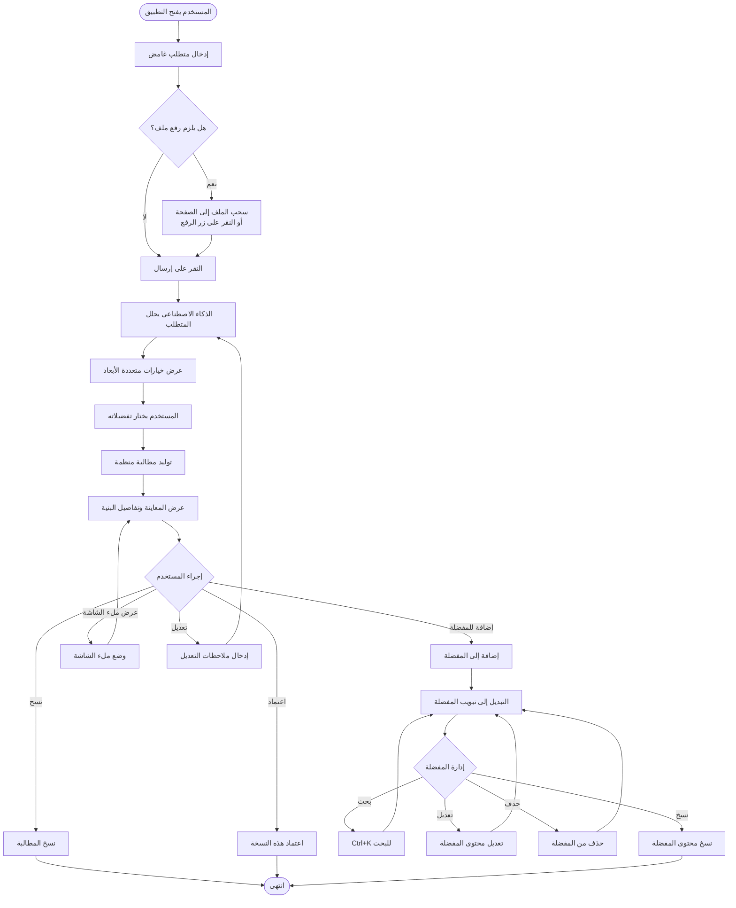
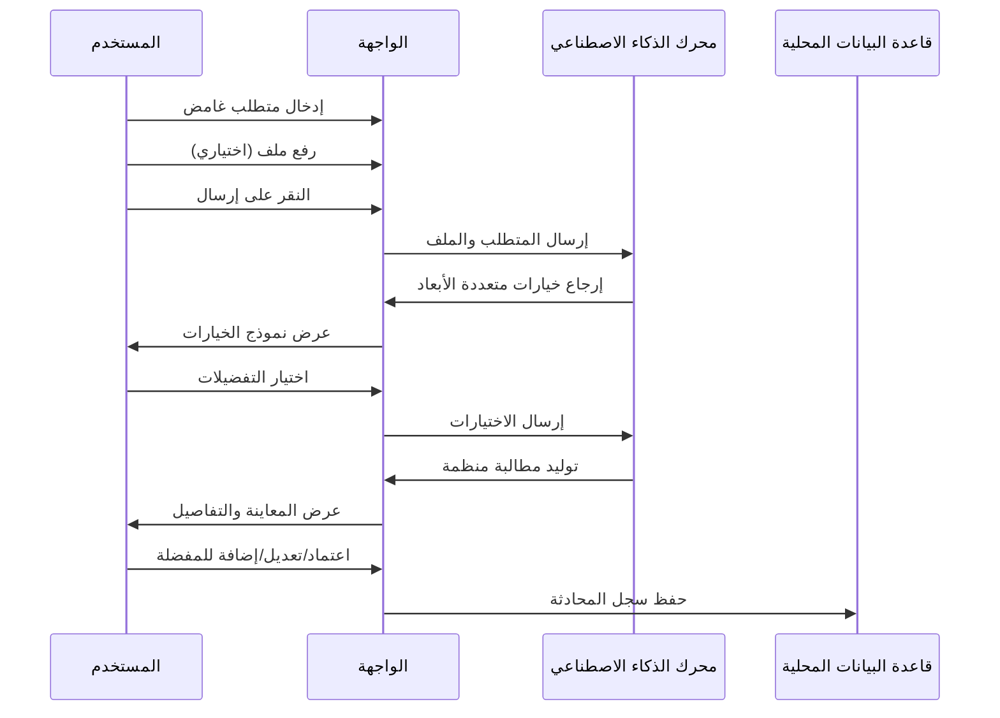
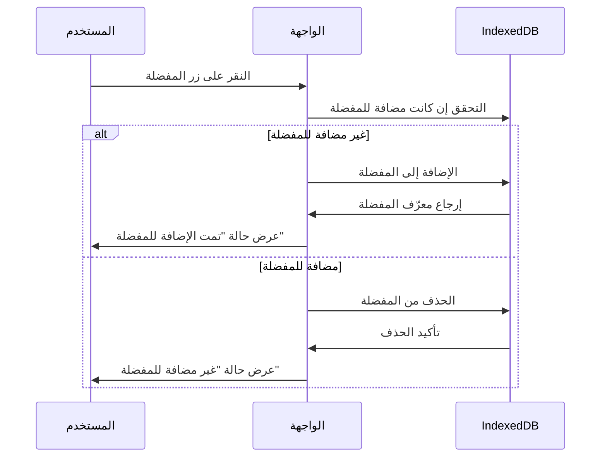
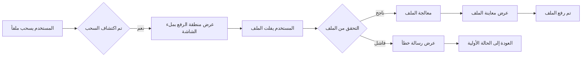

# مخطط تدفق تفاعل المستخدم

## تدفق التفاعل الكامل

## تدفق الوظائف الأساسية

### 1. تدفق توليد المطالبة

### 2. تدفق إدارة المفضلة

### 3. تدفق رفع الملفات

## نقاط التفاعل الرئيسية

### اختصارات لوحة المفاتيح
- `Ctrl+K` / `Cmd+K`: فتح بحث Spotlight
- `Tab`: التبديل بين المحادثات/المفضلة في البحث
- `↑↓`: التنقل في نتائج البحث
- `Enter`: اختيار نتيجة البحث

### التغذية الراجعة للحالة
- زر المفضلة: اللون الأصفر يعني مضافة للمفضلة، والرمادي يعني غير مضافة
- السحب للرفع: تنبيه متحرك بملء الشاشة لمنطقة الرفع
- تبديل التبويبات: تأثير حركة انزلاقية
- حالة التحميل: حركة نبضية وتنبيه التحميل

### حفظ البيانات
- سجل المحادثات: حفظ تلقائي في IndexedDB
- المطالبات المفضلة: تخزين محلي مع دعم البحث والإدارة
- إعدادات المستخدم: API Key وBase URL واختيار النموذج
